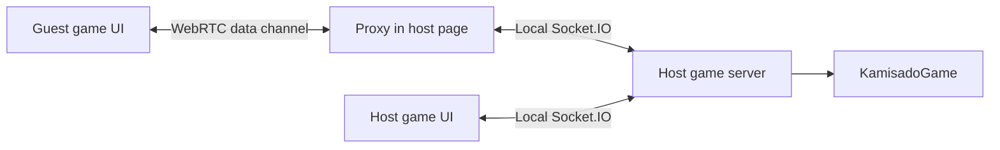

# Architecture

See the [README](../README.md) for an overview, [Development](development.md) for commands, and [Rules](rules.md) for game behavior.

Kamisado shares one rules engine and match controller across browser, desktop, and mobile games. The host owns the match state, and clients render that state and send player actions. Desktop hosts use a Node server; mobile hosts run the same controller inside their WebView. Electron and Capacitor provide the platform launchers.

## Source map

```text
src/
  server/
    index.ts              Node HTTP/Socket.IO entry point and server lifecycle
    sessions.ts           Shared match controller, player sessions, clocks, AI scheduling
    game.ts               Kamisado rules and match state
    ai/
      engine.ts           Bounded classical search and evaluation
      position.ts         Private search positions using the game rules
      runner.ts           Worker queue, cancellation, and deadlines
      worker.ts           Worker-thread message entry point
  client/
    client.ts             Browser entry point, actions, state updates, rendering
    invitation.ts         Shared invitation URL, clipboard, and QR display
    peer-panel.ts         Manual WebRTC invitation/reply controls
    p2p-transport.ts       WebRTC channel and host-side Socket.IO proxy
    realistic-art.ts      Shared palette, character markings, and SVG towers
    board-3d.ts            Three.js board, picking, camera, and resource disposal
  mobile/                 Capacitor launcher, local event transport, Web Worker adapter
  desktop/
    main.ts               Electron window, trusted IPC, startup, and shutdown
    preload.ts            Narrow API exposed to the launcher
    contracts.ts          Launcher API and state types
    hosting-controller.ts Server/connectivity transitions and credential handling
    connectivity/         LAN address selection, ngrok, and provider lifecycle
    token-vault.ts        Encrypted token file storage
  shared/
    types.ts              Game state, moves, settings, and socket contracts
    constants.ts          Board colors and starting layouts
    ai-levels.ts          Ten difficulty profiles and search budgets
    invitation-url.ts     Invitation validation shared by browser and desktop
public/                   Game HTML, CSS, and asset licenses
desktop/                  Launcher HTML/CSS/JavaScript and offline quickstart
tests/                    Unit, integration, and browser checks
scripts/                  Integration runner, relay helper, packaging checks
```

The build compiles `src/` to `dist/` and bundles `src/client/client.ts` into `public/client.js`. These are generated files. The server serves `public/`; Electron starts at `dist/desktop/main.js` and loads `desktop/index.html`. `build-client.js`, the TypeScript configurations, and `forge.config.js` define those boundaries. Build and test commands are in [Development](development.md).

## Rules and sessions

[`KamisadoGame`](../src/server/game.ts) owns movement validation, forced colors and passes, deadlocks, sumo pushes, rounds, scoring, layouts, and clock state. It serializes the position as `GameState`. Keep rule changes here so human moves and computer search continue to use the same transitions.

[`src/server/sessions.ts`](../src/server/sessions.ts) wraps games in sessions with player/socket assignments, spectators, disconnect records, and scheduled work. It validates incoming event data and the acting socket before applying a move, then broadcasts the updated state. The server schedules clock expiry and round transitions; client countdowns are a display of that state.

Games and player sessions live in memory. There is no database or saved-match recovery. Browser identity is kept in `localStorage`, so two tabs at the same origin normally represent the same player. Reconnecting replaces that player's old socket; the old socket loses its authority to act. This identity is a session mechanism, not an account system.

## Computer turns

The server schedules a search when the computer is due to move. It sends a snapshot, match settings, difficulty, and time budget to [`ai/runner.ts`](../src/server/ai/runner.ts). The runner allows two active workers and sixteen queued jobs, and terminates a worker when its job finishes, is cancelled, or exceeds its deadline.

The worker calls `chooseMove` in `engine.ts`. Search uses iterative deepening, alpha-beta pruning, move ordering, a bounded transposition table, and handwritten evaluation. `position.ts` creates private rule-engine instances with clocks disabled. Difficulty profiles set depth, node, and time limits; the server also reduces the search budget when the match clock is low.

When a result arrives, the server checks the session, round, turn, and search generation, then validates the proposed move against the live game. Search failure or an invalid proposal uses a legal fallback. Disconnecting, ending a game, or shutting down cancels pending work; a late result cannot change a newer position. The design rationale and calibration limits are documented in [AI research](ai-research.md).

## Browser, LAN, and relay connections

Express serves the game page at `/` and `/game/:gameId`, plus `/health`. Socket.IO serves its own browser client at `/socket.io/socket.io.js`. The application bundle, QR code generator, Three.js code, styles, and tower markings are available locally.

The standalone server uses `PORT` or `3000`. Desktop LAN hosting listens on `0.0.0.0`; offline computer play and both desktop P2P modes listen on `127.0.0.1`. The desktop prefers port `32145` and falls back to an available port if it is occupied.

The direct connectivity provider ranks available IPv4 addresses and supplies the address used in invitations. An explicit advertised origin can override that choice. The ngrok provider opens an optional tunnel to the same server and supplies its public origin. Switching the LAN address or relay changes connectivity while retaining the running game server.

The browser obtains the current advertised origin from `/runtime-config.js` and subsequent `runtimeConfig` socket events. `InvitationPanel` updates the link and QR code together when the origin changes. This origin controls invitation generation; the browser's Socket.IO connection remains attached to the page's own origin.

## Manual WebRTC connections

The `?peer=host` and `?peer=guest` page modes use [`PeerPanel`](../src/client/peer-panel.ts) for the code exchange. The host creates a normal server game first. `P2pTransport` gathers ICE candidates into an invitation code; the guest returns a reply code, which the host applies to complete the connection. The codes include the game ID, a connection session ID, and SDP. They are temporary connection descriptions, not permanent room links.



The guest uses a small Socket.IO-shaped adapter, so the game UI can share its event handling. It does not open a Socket.IO connection for game traffic. The host browser opens an additional local Socket.IO connection for the guest and forwards a fixed set of supported events. The proxy confines requests to the invited room and assigns the guest's server identity itself. It bounds message size, request rate, and pending acknowledgements.

The default ICE configuration uses Google's public STUN service to discover addresses. There is no signaling service or TURN relay in this mode: players exchange codes themselves, and game traffic uses the WebRTC data channel. Some networks cannot establish a direct connection. Both local pages and the host server must remain running. The desktop guest runs a local server to serve its page; the host's server owns the match.

## Mobile boundary

Capacitor bundles the same game page for Android and iOS. `src/mobile/main.ts` provides the menu and native lifecycle hooks. The mobile host connects the UI and P2P proxy to `createSessionHost` through an in-memory transport; it does not run Express or Node. That shared controller still owns moves, clocks, rounds, sessions, and AI scheduling. A Web Worker runs the same AI search used by Node's worker threads.

`src/client/event-socket.ts` supplies the shared event/acknowledgement adapter for mobile host sockets and WebRTC guests. Desktop and browser clients continue to connect through Socket.IO. Mobile LAN links open in the system browser, outside the native bridge. See [Mobile](mobile.md) for the build pipeline and lifecycle limits.

## Electron boundary

[`main.ts`](../src/desktop/main.ts) creates one sandboxed window with context isolation and Node integration disabled. The launcher loads from disk and embeds the local game in an iframe. The preload exposes `window.kamisadoDesktop` only to the main frame. IPC handlers check that requests came from the trusted launcher before starting or stopping hosting, copying text, opening an invitation, or changing token storage.

`HostingController` serializes start/stop operations and owns the server, connectivity provider, and token references. Changing between LAN, computer, and P2P session scopes requires ending the current session. Changing the advertised LAN address or enabling a relay within an existing LAN session preserves its server. If relay setup fails during a running session, the controller attempts to retain LAN hosting.

Remembered ngrok tokens pass through Electron `safeStorage` and `TokenVault`. Persistent storage is enabled only when encryption is available; Linux's `basic_text` backend is excluded. Otherwise a supplied token remains in memory for the app session. The game iframe has no token or Electron API access.

Stopping hosting sends `hostStopped`, clears games and timers, terminates AI workers, closes sockets, and then releases the connectivity provider. After giving the shutdown notice time to drain, the server also closes leftover TCP connections so an incomplete HTTP request cannot hold shutdown open. Closing the desktop window runs the same cleanup before quitting. Restarting creates a fresh server session.

## Display and assets

`client.ts` applies state to the game controls and chooses either realistic 2D or 3D rendering. Both views use the palette and fixed character contours in `realistic-art.ts`. The 2D view uses SVG towers; `board-3d.ts` builds geometry and canvas textures with Three.js. Symbol mode uses the same markings on squares, towers, and turn instructions.

Board view, symbol mode, and AI level are browser preferences stored in `localStorage`; they do not change the rules or the opponent's display. A failed 3D initialization falls back to 2D. Switching away from 3D or leaving the page disposes its rendering resources.

The character contours derive from Noto Sans CJK and carry the license in [`public/licenses/NotoSansCJK-OFL.txt`](../public/licenses/NotoSansCJK-OFL.txt). Rendering does not require an installed CJK font or downloaded image assets. `ref_imgs/` contains design references and is excluded from desktop packages.

## Lifecycle and recovery limits

An active disconnected player has **up to 60 seconds** to return. Between rounds, the independent 30-second confirmation deadline can end the match sooner. The server pauses the match clock while a player is disconnected and resumes it when both are present. The normal browser transport reconnects through Socket.IO. A closed P2P channel requires a fresh invitation/reply exchange while the game is still recoverable; the host page retains the peer seat identity in `sessionStorage` for same-tab reloads.

P2P setup has separate bounds: up to 10 seconds for ICE gathering, 30 seconds for connection establishment, and 10 minutes to exchange a code. Those setup limits do not extend a running game's 60-second recovery window. Waiting lobbies expire after 10 minutes, and completed games are retained for 5 minutes before removal.

Stopping or restarting the host discards all sessions immediately. Changing the host's address may also require guests to open the updated invitation; announcing a new origin does not move their existing connection. Tests cover local reconnection and cleanup, but local WebRTC tests cannot establish reachability across every Internet network.
