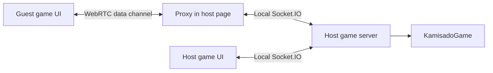

# Architecture

See the [README](../README.md) for an overview, [Development](development.md) for commands, and [Rules](rules.md) for game behavior.

Kamisado shares one rules engine and match controller across browser, desktop, and mobile games. The host owns the match state, and clients render that state and send player actions. Desktop hosts use a Node server; mobile hosts run the same controller inside their WebView. Electron and Capacitor provide the platform launchers.

## Source map

```text
src/
  server/
    index.ts              Node HTTP/Socket.IO entry point and server lifecycle
    sessions.ts           Shared match controller, player sessions, clocks, AI scheduling
    game.ts               Kamisado rules and match state
    ai/
      engine.ts           Bounded classical search and evaluation
      position.ts         Private search positions using the game rules
      runner.ts           Worker queue, cancellation, and deadlines
      worker.ts           Worker-thread message entry point
  client/
    client.ts             Browser entry point, actions, state updates, rendering
    invitation.ts         Shared invitation URL, clipboard, and QR display
    peer-panel.ts         Quick connect, manual exchange, and relay controls
    automatic-peer.ts     PeerJS signaling and invitation authentication
    p2p-transport.ts       WebRTC channel and host-side Socket.IO proxy
    realistic-art.ts      Shared palette, character markings, and SVG towers
    board-3d.ts            Three.js board, picking, camera, and resource disposal
  mobile/                 Capacitor launcher, local event transport, Web Worker adapter
  desktop/
    main.ts               Electron window, trusted IPC, startup, and shutdown
    preload.ts            Narrow API exposed to the launcher
    contracts.ts          Launcher API and state types
    hosting-controller.ts Server/connectivity transitions and credential handling
    connectivity/         LAN, Cloudflare, ngrok, and provider lifecycle
    token-vault.ts        Encrypted token file storage
  shared/
    types.ts              Game state, moves, settings, and socket contracts
    constants.ts          Board colors and starting layouts
    ai-levels.ts          Ten difficulty profiles and search budgets
    invitation-url.ts     Invitation validation shared by browser and desktop
public/                   Game HTML, CSS, and asset licenses
desktop/                  Launcher HTML/CSS/JavaScript and offline quickstart
tests/                    Unit, integration, and browser checks
scripts/                  Integration runner, relay helper, packaging checks
```

The build compiles `src/` to `dist/` and bundles `src/client/client.ts` into `public/client.js`. These are generated files. The server serves `public/`; Electron starts at `dist/desktop/main.js` and loads `desktop/index.html`. `build-client.js`, the TypeScript configurations, and `forge.config.js` define those boundaries. Build and test commands are in [Development](development.md).

## Rules and sessions

[`KamisadoGame`](../src/server/game.ts) owns movement validation, forced colors and passes, deadlocks, sumo pushes, rounds, scoring, layouts, and clock state. It serializes the position as `GameState`. Keep rule changes here so human moves and computer search continue to use the same transitions.

[`src/server/sessions.ts`](../src/server/sessions.ts) wraps games in sessions with player/socket assignments, spectators, disconnect records, and scheduled work. It validates incoming event data and the acting socket before applying a move, then broadcasts the updated state. The server schedules clock expiry and round transitions; client countdowns are a display of that state.

Games and player sessions live in memory. There is no database or saved-match recovery. Browser identity is kept in `localStorage`, so two tabs at the same origin normally represent the same player. Reconnecting replaces that player's old socket; the old socket loses its authority to act. This identity is a session mechanism, not an account system.

## Computer turns

The server schedules a search when the computer is due to move. It sends a snapshot, match settings, difficulty, and time budget to [`ai/runner.ts`](../src/server/ai/runner.ts). The runner allows two active workers and sixteen queued jobs, and terminates a worker when its job finishes, is cancelled, or exceeds its deadline.

The worker calls `chooseMove` in `engine.ts`. Search uses iterative deepening, alpha-beta pruning, move ordering, a bounded transposition table, and handwritten evaluation. `position.ts` creates private rule-engine instances with clocks disabled. Difficulty profiles set depth, node, and time limits; the server also reduces the search budget when the match clock is low.

When a result arrives, the server checks the session, round, turn, and search generation, then validates the proposed move against the live game. Search failure or an invalid proposal uses a legal fallback. Disconnecting, ending a game, or shutting down cancels pending work; a late result cannot change a newer position. The design rationale and calibration limits are documented in [AI research](ai-research.md).

## Browser, LAN, and relay connections

Express serves the game page at `/` and `/game/:gameId`, plus `/health`. Socket.IO serves its own browser client at `/socket.io/socket.io.js`. The application bundle, QR code generator, Three.js code, styles, and tower markings are available locally.

The standalone server uses `PORT` or `3000`. Desktop LAN hosting listens on `0.0.0.0`; offline computer play and both desktop P2P modes listen on `127.0.0.1`. The desktop prefers port `32145` and falls back to an available port if it is occupied.

The direct connectivity provider ranks available IPv4 addresses and supplies the address used in invitations. An explicit advertised origin can override that choice. The ngrok provider opens an optional tunnel to the same server and supplies its public origin. Switching the LAN address or relay changes connectivity while retaining the running game server.

The browser obtains the current advertised origin from `/runtime-config.js` and subsequent `runtimeConfig` socket events. `InvitationPanel` updates the link and QR code together when the origin changes. This origin controls invitation generation; the browser's Socket.IO connection remains attached to the page's own origin.

## WebRTC connections

The `?peer=host` and `?peer=guest` page modes use [`PeerPanel`](../src/client/peer-panel.ts) for setup. The host creates a normal server game first. Both Quick connect and manual exchange lead to a WebRTC data channel and use the same guest adapter and host proxy for game events.

Quick connect uses [`automatic-peer.ts`](../src/client/automatic-peer.ts) and PeerJS Cloud to exchange SDP and ICE candidates. The host shares a `kamisado://join/K2.…` link; opening it starts joining automatically. The public signaling service is an external dependency for establishing a connection. It does not host the match or carry game events, and its loss does not close an established data channel. Neither players nor the maintainer need to deploy a signaling server or create an account. See the [PeerJS documentation](https://peerjs.com/client/getting-started) for the service's role.

[`peer-invitation.ts`](../src/shared/peer-invitation.ts) validates app links in the native shell and shared client. Only the exact join route and a canonical invitation token are accepted; links cannot supply a server URL or a file path. Android intent filters, iOS URL schemes, and Electron's protocol handler deliver both cold and warm launches. The token reaches the local guest page in its fragment and is removed immediately. Opening another invitation asks before replacing an active match. `share-link.ts` uses the Capacitor share sheet on phones, Web Share where supported, and the clipboard otherwise. Nothing is hosted at the app-link address.

Desktop and mobile open the shared game-settings UI directly. The host transport stays idle until a friend is invited; computer games use the same local match controller without publishing an invitation. Desktop connection settings still offer LAN and ngrok modes.

The invitation contains a random 128-bit secret. A hash-derived identifier routes setup messages through the broker without revealing that secret. After the data channel opens, the apps authenticate it using HMAC proofs bound to their WebRTC certificate fingerprints before forwarding game events. This makes possession of the invitation necessary to join and ties the proof to the channel. It is not an account or verified identity system: anyone who receives the invitation can attempt to join. The broker still sees signaling metadata, and the protocol has not received an independent security audit.

Under **Advanced**, manual exchange retains the `KAMISADO1` invitation/reply format. `P2pTransport` gathers ICE candidates into an invitation code; the guest returns a reply code, which the host applies to complete the connection. Those codes include the game ID, a connection session ID, and SDP. They are temporary connection descriptions, not permanent room links. This mode does not use PeerJS Cloud.



The guest uses a small Socket.IO-shaped adapter, so the game UI can share its event handling. It does not open a Socket.IO connection for game traffic. The host browser opens an additional local Socket.IO connection for the guest and forwards a fixed set of supported events. The proxy confines requests to the invited room and assigns the guest's server identity itself. It bounds message size, request rate, and pending acknowledgements.

The default ICE configuration uses Google's public STUN service. Quick connect attempts direct transport for up to 12 seconds, then retries once through TURN when local temporary credentials are configured. `shared/turn-settings.ts` validates those credentials. The host registers a second signaling address derived from the invitation secret with a separate hash input; registering it creates no RTC connection or TURN allocation. After direct transport fails, the guest connects to that address with `iceTransportPolicy: 'relay'`. Both paths use the same fingerprint-bound authentication and only one authenticated channel can win. The invitation stays unchanged; both signaling registrations disconnect after success. Authentication failures, unavailable invitations, and cancellation do not trigger automatic retry.

Quick connect also offers **TURN only (skip P2P)**. A host issues a `K2R.` invitation and registers only the relay route. A guest with a normal `K2.` invitation can skip the direct attempt and connect to the host's standby relay route, if configured. Relay-only attempts never fall back to direct transport. Manual code exchange retains explicit relay retries. The optional ICE JSON importer validates data without executing provider snippets, accepts one shared credential, and retains at most four addresses, preferring TLS. Quick connect wraps the underlying K2/K2R invitation and validated session credentials in a bounded K3 payload. The wrapper is base64url-encoded, not encrypted, and never sent to the signaling broker. Its inner secret drives the existing peer ID and authentication. Shared credentials stay out of the guest form and browser storage. Legacy invitations and manual exchange retain their original behavior. No TURN service or provider account is bundled. Connection status uses the selected ICE candidate pair to distinguish direct from relayed data channels. Both apps and the host must remain running; the host's device still owns the match.

`shared/turn-provider.ts` validates Metered account domains, computes conservative lifetime estimates, and creates expiring credentials. Desktop requests cross a source/origin-checked frame bridge and a trusted-shell IPC handler; mobile uses Capacitor native HTTP. Neither path exposes a provider endpoint on the game server. Requests use only HTTPS account subdomains of `metered.live`, reject redirects, use timeouts, and return sanitized errors. The provider account secret is kept only on the host screen. It never enters a game message, invitation, or storage. Native bridge logging is disabled because bridge payloads contain credentials.

Generation happens before each new human lobby when enabled. Shared metadata records provider expiry and a two-minute activation delay; guests wait with a countdown, reject expired access, and then join automatically. This is independent of the ten-minute signaling invitation timeout. Imported credentials have no invented expiry. There is no mid-game automatic renewal or credential revocation; the provider's expiry controls generated access.

## Mobile boundary

Capacitor bundles the same game page for Android and iOS. `src/mobile/main.ts` provides the menu and native lifecycle hooks. The mobile host connects the UI and P2P proxy to `createSessionHost` through an in-memory transport; it does not run Express or Node. That shared controller still owns moves, clocks, rounds, sessions, and AI scheduling. A Web Worker runs the same AI search used by Node's worker threads.

`src/client/event-socket.ts` supplies the shared event/acknowledgement adapter for mobile host sockets and WebRTC guests. Desktop and browser clients continue to connect through Socket.IO. Mobile LAN links open in the system browser, outside the native bridge. See [Mobile](mobile.md) for the build pipeline and lifecycle limits.

## Electron boundary

[`main.ts`](../src/desktop/main.ts) creates one sandboxed window with context isolation and Node integration disabled. The launcher loads from disk and embeds the local game in an iframe. The preload exposes `window.kamisadoDesktop` only to the main frame. IPC handlers check that requests came from the trusted launcher before starting or stopping hosting, copying text, opening an invitation, or changing token storage.

`HostingController` serializes start/stop operations and owns the server, connectivity provider, and token references. Changing between LAN, computer, and P2P session scopes requires ending the current session. Changing the advertised LAN address or enabling a relay within an existing LAN session preserves its server. If relay setup fails during a running session, the controller attempts to retain LAN hosting.

Remembered ngrok tokens pass through Electron `safeStorage` and `TokenVault`. Persistent storage is enabled only when encryption is available; Linux's `basic_text` backend is excluded. Otherwise a supplied token remains in memory for the app session. The game iframe has no token or Electron API access.

Stopping hosting sends `hostStopped`, clears games and timers, terminates AI workers, closes sockets, and then releases the connectivity provider. After giving the shutdown notice time to drain, the server also closes leftover TCP connections so an incomplete HTTP request cannot hold shutdown open. Closing the desktop window runs the same cleanup before quitting. Restarting creates a fresh server session.

## Display and assets

`client.ts` applies state to the game controls and chooses either realistic 2D or 3D rendering. Both views use the palette and fixed character contours in `realistic-art.ts`. The 2D view uses SVG towers; `board-3d.ts` builds geometry and canvas textures with Three.js. Symbol mode uses the same markings on squares, towers, and turn instructions.

Board view, symbol mode, and AI level are browser preferences stored in `localStorage`; they do not change the rules or the opponent's display. A failed 3D initialization falls back to 2D. Switching away from 3D or leaving the page disposes its rendering resources.

The character contours derive from Noto Sans CJK and carry the license in [`public/licenses/NotoSansCJK-OFL.txt`](../public/licenses/NotoSansCJK-OFL.txt). Rendering does not require an installed CJK font or downloaded image assets. `ref_imgs/` contains design references and is excluded from desktop packages.

## Lifecycle and recovery limits

An active disconnected player has **up to 60 seconds** to return. Between rounds, the independent 30-second confirmation deadline can end the match sooner. The server pauses the match clock while a player is disconnected and resumes it when both are present. The normal browser transport reconnects through Socket.IO. A closed P2P channel requires a fresh invitation while the game is still recoverable; manual mode also requires a reply. The host page retains the peer seat identity in `sessionStorage` for same-tab reloads.

P2P invitations expire after 10 minutes. Manual setup allows up to 10 seconds for direct ICE gathering (20 seconds for a relay retry) and 30 seconds for connection establishment. A manual relay retry must obtain a relay candidate before producing a code. Quick connect also bounds setup and authentication waits. These limits do not extend a running game's 60-second recovery window. Waiting lobbies expire after 10 minutes, and completed games are retained for 5 minutes before removal.

Stopping or restarting the host discards all sessions immediately. Changing the host's address may also require guests to open the updated invitation; announcing a new origin does not move their existing connection. Tests cover local reconnection and cleanup, but local WebRTC tests cannot establish reachability across every Internet network.

## Tunnel invitations

`src/client/tunnel-panel.ts` is shared by desktop and Android. Creating a human game first asks the native host to prepare the chosen tunnel; failure leaves the settings intact. Computer games never start a tunnel. The invitation panel uses the returned public origin and the existing game ID.

Desktop reuses the HTTP/Socket.IO server. Its trusted launcher accepts tunnel requests only from the current local game frame. `cloudflare-provider.ts` downloads a pinned upstream executable, verifies its SHA-256, starts it without a shell, waits for registration and public reachability through Electron's network stack, and kills it when hosting ends. It uses HTTP/2 so the connector does not require outbound UDP. The ngrok SDK remains the alternative provider. Neither provider's account credentials appear in guest invitations.

Android runs the same `createSessionHost` in the local WebView. `GameTunnelPlugin` listens only on loopback and serves a separate browser bundle plus a small JSON long-poll transport. `tunnel-host.ts` maps guest events to the existing local event sockets. Remote guests cannot create or cancel host games or call native plugins. Each connection has a random session handle, a bounded event queue, one outstanding poll, idle cleanup, request-size limits, and a send-rate limit. The browser restores its player session after reconnecting. The plugin serves only an explicit asset allowlist, never the Capacitor host bundle.

The Android connector is built from pinned official Cloudflare source plus a small Go resolver adapter, and packaged in the APK's native library directory. On Android 10+, `AndroidDnsProxy` forwards DNS wire queries through the system resolver, preserving VPN/private DNS policy; it shuts down with the connector. Earlier Android versions can play offline or join in a browser. There is no runtime executable download, Termux dependency, or duplicated rules engine. The host must remain in the foreground; no continuous background service is installed. Native ngrok and iOS tunnel hosting are not included.
